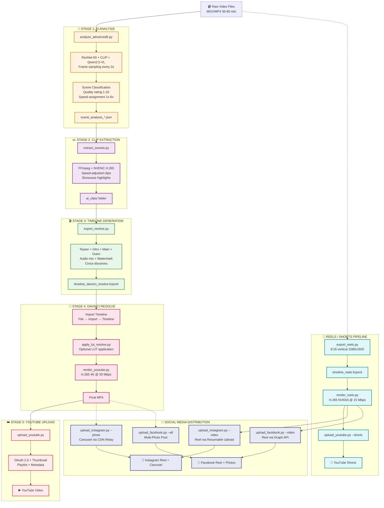
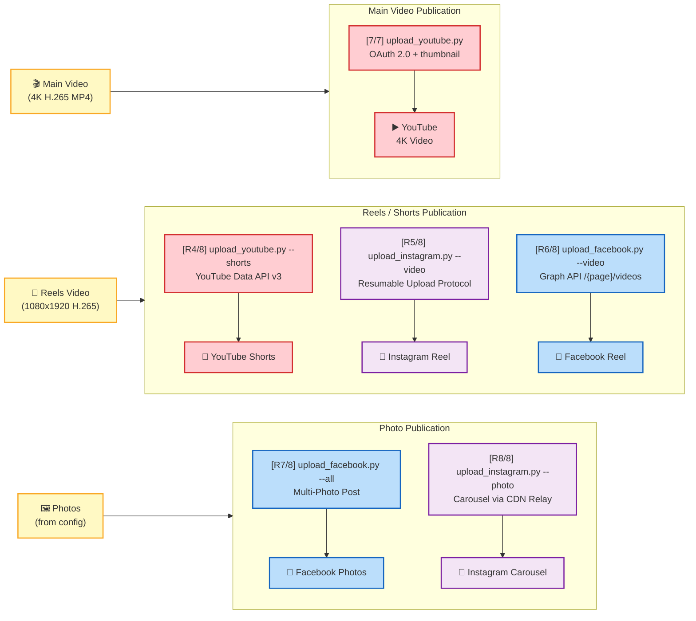
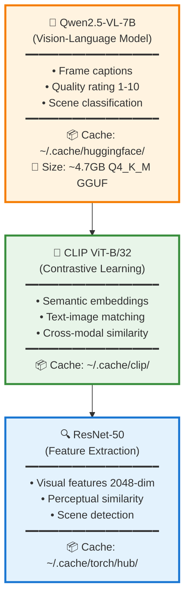
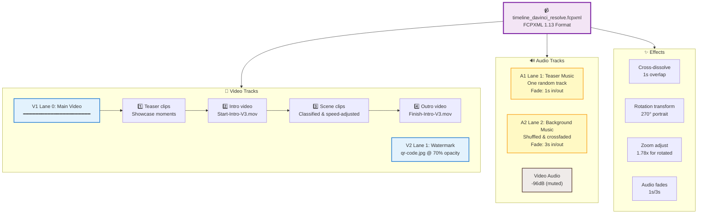

# AI Video Editing Pipeline

## Why This Project Exists

**The Problem:** Creating engaging video content from long-form footage is painfully time-consuming. A typical 60-minute recording requires 4-6 hours of manual editing—watching every frame, identifying interesting moments, cutting boring sections, adjusting speeds, adding music, and polishing transitions. For hobbyists creating scale model builds, DIY projects, or tutorial content, this workload is unsustainable. Videos pile up unedited, creative momentum dies, and content never reaches an audience.

**The Solution:** This AI-powered pipeline compresses weeks of manual editing into minutes of automated processing. By leveraging vision-language models, computer vision, and intelligent scene classification, the system watches your footage for you, identifies what's worth keeping, eliminates dead time, and generates broadcast-ready timelines—complete with music, transitions, and dynamic speed ramping.

**The Value:**
- **Time Savings:** 60 min → 15 min final video in ~20 minutes of processing (vs. 6 hours manual editing)
- **Consistency:** AI applies uniform quality standards across all footage, eliminating subjective editing fatigue
- **Discoverability:** Automatic teaser generation highlights the best moments upfront, boosting viewer retention
- **Scalability:** Process entire video backlogs overnight; edit 10 videos as easily as 1
- **Creative Freedom:** Spend time creating content, not editing it

This pipeline isn't just a tool—it's a force multiplier for solo creators who want to share their work without drowning in post-production.

---

## 🚀 Quick Start - Run Everything in One Command

```bash
# Complete automated pipeline: Raw video → Edited timeline
python run_pipeline.py
```

### Pipeline Modes

The pipeline supports four modes, set via `"mode"` in `project_config.json` or `--mode` on the command line (CLI overrides config):

| Mode | Audio | Speed | Boring detection | Use case |
|------|-------|-------|------------------|----------|
| `build` | Muted → background music | Variable (1x–6x by scene rating) | LLM visual analysis only | Silent build/craft videos — no narration |
| `unboxing` | **Kept** (narration preserved) | **1.0x always** | Audio silence + video freeze + LLM | Voice-over videos — unboxing, reviews, tutorials |
| `reels` | Muted → music overlay | 1.0x | N/A (uses existing analysis) | Short-form 9:16 vertical clips |
| `event_memory` | Kept only in source references / preview trims | 1.0x | Heuristic + human notes | Activity/event recap timelines from real videos and photos |

#### Mode benefits comparison

| Feature | Build | Unboxing | Reels |
|---------|:-----:|:--------:|:-----:|
| AI scene classification (Qwen2.5-VL) | ✅ | ✅ | — |
| Speed ramping (1x–6x) | ✅ | — | — |
| Audio silence detection (ffmpeg) | — | ✅ | — |
| Video freeze detection (ffmpeg) | — | ✅ | — |
| Original narration preserved | — | ✅ | — |
| Background music overlay | ✅ | — | ✅ |
| Teaser section generated | ✅ | ✅ | — |
| 9:16 vertical crop | — | — | ✅ |
| Duplicate scene detection | ✅ | ✅ | — |
| Watermark overlay | ✅ | ✅ | ✅ |

### Event memory mode

`event_memory` is a deterministic recap workflow for real event footage and photos. It does not require CUDA, NVIDIA/NVENC, cloud APIs, or a real vision model in dry-run mode.

```bash
python run_pipeline.py \
  --mode event_memory \
  --input ./footage \
  --output ./project_output \
  --dry-run \
  --yes
```

Inputs can include `.mp4`, `.mov`, `.m4v`, `.jpg`, `.jpeg`, `.png`, and `.heic` files. Optional `human_notes.csv` can guide selection with these columns:

```csv
file,start,end,human_note,importance,must_include,avoid_use,event_role,preferred_use
```

The mode writes inspectable artifacts:

- `media_index.json`
- `analysis_segments.json`
- `scored_segments.json`
- `candidate_events.json`
- `timeline.json`
- `review.md`
- `logs/event_memory.log`
- `event_memory.fcpxml`

`event_memory.fcpxml` targets FCPXML 1.14 for modern Final Cut Pro imports. Media paths are written as `media-rep` children of each `asset`, not as `src` attributes on `asset`.

Pass `--render-preview` to attempt a simple FFmpeg `review_preview.mp4`. Preview rendering uses macOS-friendly VideoToolbox encoders when available and falls back to `libx264`.

#### How each mode runs end-to-end

**Build mode** — silent workshop footage, speed-ramped with background music:

| Stage | What happens |
|-------|-------------|
| **1 — Analysis** | Frames sampled every 2 s → ResNet-50 + CLIP + Qwen2.5-VL classify each scene (boring / low / moderate / interesting) and assign speed 1x–6x |
| **2 — Extraction** | FFmpeg (NVENC) renders each clip at its assigned speed; audio is discarded (speed > 1x uses `atempo` chain) |
| **3 — Timeline** | FCPXML built with teaser + intro + main + outro; video audio muted (−96 dB); background music shuffled on lane 2; cross-dissolves + watermark |

**Unboxing mode** — narrated video, audio preserved, boring = silent + static:

| Stage | What happens |
|-------|-------------|
| **1 — Analysis** | Same AI vision pass **plus** `analyze_audio.py` runs `ffmpeg silencedetect` (< −35 dB, ≥ 3 s) and `freezedetect` (threshold 0.02) on each video. LLM prompt tuned for narration quality, reveals, close-ups. All speeds forced to **1.0x** |
| **1b — Boring merge** | Scenes where silence AND freeze overlap ≥ 60 % are downgraded to *boring* and excluded |
| **2 — Extraction** | FFmpeg renders at 1.0x — **audio stays intact** (no atempo, no mute) |
| **3 — Timeline** | FCPXML keeps original audio on every clip (no −96 dB mute); **no background music** added; teaser, intro/outro, watermark still included |

**Reels mode** — short vertical clips from existing analysis:

| Stage | What happens |
|-------|-------------|
| **1–2** | Skipped (reuses existing `scene_analysis_*.json` + `ai_clips/`) |
| **3 — Timeline** | Builds `timeline_reels.fcpxml` with 9:16 crop, vertical layout, music from `assets/music-teaser/` |

#### Config examples

**Build mode** (default) — silent workshop footage, speed-ramped with background music:
```json
{
  "mode": "build"
}
```

**Unboxing mode** — narrated video, audio preserved, boring = silent + static segments cut:
```json
{
  "mode": "unboxing",
  "unboxing": {
    "keep_audio": true,
    "keep_speed": true,
    "silence_threshold_db": -35,
    "silence_min_duration": 3.0,
    "motion_threshold": 0.02,
    "boring_requires_both": true
  }
}
```

| Config key | Purpose | Default |
|------------|---------|---------|
| `keep_audio` | Preserve original narration in extracted clips | `true` |
| `keep_speed` | Force all scenes to 1.0x (no speedup) | `true` |
| `silence_threshold_db` | dB level below which audio counts as "silent" | `-35` |
| `silence_min_duration` | Minimum seconds of silence to flag a segment | `3.0` |
| `motion_threshold` | Freeze-detect pixel-diff threshold (0 = identical frames) | `0.02` |
| `boring_requires_both` | Require **both** silence + freeze to mark boring (`false` = either) | `true` |

**Reels mode** — skip analysis/extract, only build vertical short timeline:
```json
{
  "mode": "reels"
}
```

#### Command-line override

```bash
# Run as build (default)
python run_pipeline.py

# Run as unboxing — keep narration audio, no speedup
python run_pipeline.py --mode unboxing

# Run as reels only
python run_pipeline.py --mode reels
# or equivalently:
python run_pipeline.py --reels-only

# Non-interactive (auto-confirm all prompts)
python run_pipeline.py --mode unboxing --yes

# Full unboxing pipeline + reels, no prompts
python run_pipeline.py --mode unboxing --reels-only --yes
```

### Unboxing mode details

In unboxing mode the pipeline additionally runs **audio silence detection** (ffmpeg `silencedetect`) and **freeze/static frame detection** (ffmpeg `freezedetect`) on each video. Segments where both silence AND static video overlap are marked as boring and excluded. All other scenes keep their original 1.0x speed and narration audio intact — no background music is added.

**What it does:**
1. **Stage 1**: Analyzes all videos with AI (ResNet-50, CLIP, Qwen2.5-VL)
2. **Stage 2**: Extracts scenes and creates speed-adjusted clips
3. **Stage 3**: Generates DaVinci Resolve timeline with music and effects

**Output:** `timeline_davinci_resolve.fcpxml` ready to import into DaVinci Resolve

> 💡 **That's it!** One command processes hours of footage into an edit-ready timeline in ~20 minutes.

---

## Overview

An intelligent video editing automation system that uses computer vision and large language models to analyze, classify, and automatically edit long-form videos into engaging, compressed timelines ready for DaVinci Resolve.

This pipeline transforms lengthy raw footage (30-60+ minutes) into polished, watchable videos by automatically detecting scene quality, adjusting playback speeds, extracting highlight moments, generating professional timelines with music/transitions/watermarks, rendering in DaVinci Resolve, and uploading to YouTube.

**Key Features:**
- AI-powered scene classification (boring, low, moderate, interesting)
- Automated speed ramping (1x-6x) based on content quality
- Showcase moment extraction for teaser sections
- Intelligent duplicate scene detection across multiple videos
- DaVinci Resolve FCPXML timeline generation
- Optional LUT application in Resolve Media Pool
- YouTube rendering (H.265, 4K, bitrate control)
- YouTube upload with OAuth 2.0, playlist support, and thumbnails
- YouTube Shorts / Reels vertical 9:16 pipeline
- Instagram photo carousel and Reel upload (Meta Graph API)
- Facebook Page photo post and Reel upload (Meta Graph API)
- Auto-transcoding HEVC → H.264 for Instagram compatibility
- Multi-track audio with background music and teaser soundtracks
- Configurable watermarks with opacity and positioning
- GPU-accelerated video processing (NVENC)

## Pipeline Architecture



📊 **For detailed component breakdown and performance metrics, see [PIPELINE_DIAGRAM.md](PIPELINE_DIAGRAM.md)**

### Publication Pipeline

Once content is rendered, `run_pipeline.py` distributes it across all platforms automatically.
The main video and reels each follow their own publication path:



**Publication stages in `run_pipeline.py`:**

| Stage | Script | Platform | Content | API / Method |
|-------|--------|----------|---------|-------------|
| `[7/7]` | `upload_youtube.py` | YouTube | Main 4K video | YouTube Data API v3 (OAuth 2.0) |
| `[R4/8]` | `upload_youtube.py --shorts` | YouTube Shorts | Vertical reel | YouTube Data API v3 (OAuth 2.0) |
| `[R5/8]` | `upload_instagram.py --video` | Instagram | Reel | Meta Graph API — Resumable Upload |
| `[R6/8]` | `upload_facebook.py --video` | Facebook | Reel | Meta Graph API — `/{page_id}/videos` |
| `[R7/8]` | `upload_facebook.py --all` | Facebook | Photos | Meta Graph API — Multi-Photo Post |
| `[R8/8]` | `upload_instagram.py --photo` | Instagram | Carousel | Meta Graph API — CDN Relay |

> All upload stages require valid credentials in their respective JSON files (see [Credentials Setup](#credentials-setup)).
> Use `--yes` to skip confirmation prompts for fully automated publishing.

## Scene Classification System

The AI analyzes video content and assigns classifications that determine playback speed:

| Classification | Speed | Use Case | Description |
|---------------|-------|----------|-------------|
| **Interesting** | 1.0x | Key moments | High-action, critical content, showcase-worthy |
| **Moderate** | 2.0x | Standard content | Average interest, clear context needed |
| **Low** | 4.0x | Background activity | Minor details, setup, transitions |
| **Boring** | 6.0x | Filler content | Repetitive, minimal value (optional skip) |
| **Skip** | N/A | Excluded | Unusable footage (not exported) |

### Compression Example

```
Original Video:    45.3 minutes
├─ Interesting:     1 scene  @1x  →  0.6 min
├─ Moderate:       35 scenes @2x  →  5.2 min
├─ Low:            31 scenes @4x  →  2.4 min
└─ Boring:         12 scenes @6x  →  0.5 min (excluded)
                                    ─────────
Final Timeline:    14.7 minutes     (64% compression)
```

## AI Models and Technologies

### Computer Vision Models



### Analysis Workflow

1. **Frame Sampling**: Extract frames at 2-second intervals
2. **Caption Generation**: Qwen2.5-VL describes visual content
3. **Feature Extraction**: ResNet-50 extracts 2048-dim features
4. **Semantic Encoding**: CLIP generates embeddings
5. **Hash Computation**: Perceptual hashing for scene detection
6. **Scene Segmentation**: Group frames into logical scenes
7. **LLM Classification**: Rate and classify each scene
8. **Speed Assignment**: Map classification to playback speed

## Installation

### Prerequisites

- Python 3.9+
- CUDA-capable GPU (recommended for analysis and encoding)
- FFmpeg with NVENC support
- DaVinci Resolve (for final editing)

### Required Environment (Verified)

- **OS**: Fedora 43 (Workstation)
- **GPU**: NVIDIA GPU with NVENC support
- **RAM**: 32 GB+ recommended (16 GB minimum)
- **Storage**: SSD recommended (20 GB+ free for cache and outputs)
- **DaVinci Resolve**: 20.x (automation verified on 20.0.1)

**Downloads:**
- DaVinci Resolve: https://www.blackmagicdesign.com/support/family/davinci-resolve-and-fusion
- Filmic LUT Pack (iPhone): https://www.filmicpro.com/products/luts/
- Filmic LUT Pack direct download: https://www.filmicpro.com/downloads/Filmic_Pro_deLOG_LUT_Pack_May_2022.zip

### Setup

```bash
# Clone repository and navigate to project directory
cd ~/video

# Create virtual environment
python3 -m venv .venv
source .venv/bin/activate

# Install dependencies
pip install -r requirements.txt

# Download AI models (automatic on first run)
# Models will be cached to ~/.cache/huggingface/ and ~/.cache/clip/

### Python Requirements

All Python dependencies are pinned in [requirements.txt](requirements.txt).
```

### Directory Structure

```
~/video/
├── run_pipeline.py                # Master orchestrator (all stages)
├── analyze_advanced5.py           # Stage 1: AI video analysis
├── extract_scenes.py              # Stage 2: Scene extraction
├── export_resolve.py              # Stage 3: Timeline export (16:9)
├── export_reels.py                # Reels timeline export (9:16 vertical)
├── apply_lut_resolve.py           # LUT application via Resolve API
├── render_youtube.py              # Render 4K MP4 via Resolve API
├── render_reels.py                # Render 1080x1920 Shorts MP4 via Resolve
├── upload_youtube.py              # Upload to YouTube (main + shorts)
├── upload_instagram.py            # Upload photos/reels to Instagram
├── upload_facebook.py             # Upload photos/reels to Facebook Page
├── instagram_credentials.json     # Meta API credentials (not in git)
├── project_config.json            # Project configuration
├── assets/
│   ├── Start-Intro-V3.mov        # Intro video (10-bit)
│   ├── Finish-Intro-V3.mov       # Outro video (10-bit)
│   ├── qr-code.jpg                # Watermark image
│   ├── music-background/          # Background music (WAV)
│   ├── music-teaser/              # Teaser/reels music (WAV)
│   ├── photos/                    # Project photos
│   ├── photo-index/               # Index/thumbnail photos
│   ├── videos-reels/              # Local reels source videos
│   ├── teaser-videos/             # Teaser source videos
│   └── watermark/                 # Watermark assets
├── ai_clips/                      # Extracted scene clips
│   └── {video_stem}/
│       ├── *_scene_*.mov
│       └── *_showcase_*.mov
├── tools/
│   ├── install_gcc12.sh           # Build GCC 12 for CUDA compatibility
│   ├── build_llama_cpp_with_gcc12.sh  # Build llama-cpp-python with CUDA
│   ├── patch_cuda_math.sh         # Patch CUDA math headers
│   └── test_video_gpu.py          # GPU video processing smoke test
├── timeline_davinci_resolve.fcpxml # Main timeline (16:9)
└── timeline_reels.fcpxml           # Reels timeline (9:16)
```

## Usage

### Complete Automated Pipeline (Recommended)

```bash
# Run the full pipeline - analyze, extract, and generate timeline
python run_pipeline.py

# Non-interactive mode (auto-confirm all prompts)
python run_pipeline.py --yes

# Unboxing mode with reels, fully automated
python run_pipeline.py --mode unboxing --reels-only --yes

# Output: timeline_davinci_resolve.fcpxml + ai_clips/ folder
```

This orchestrates all stages automatically:
- **Stage 1**: AI analysis of all videos in input directory
- **Stage 2**: Scene extraction with speed adjustments
- **Stage 3**: Timeline generation with music, transitions, and effects
- **Stage 4**: Import to DaVinci Resolve + apply LUT (via Resolve API)
- **Stage 5**: Render 4K MP4 (via Resolve API)
- **Stage 6**: Upload to YouTube (OAuth 2.0)
- **Stage 7**: Upload to YouTube (OAuth 2.0)
- **Stage R1–R8** *(with `--reels-only`)*: Reels/Shorts export → Resolve → render → YouTube Shorts → Instagram Reel → Facebook Reel → Facebook Photos → Instagram Photos

### Post-Pipeline Steps

If running stages manually after `run_pipeline.py`:

```bash
# 1. Import timeline to DaVinci Resolve
#    File → Import → Timeline → timeline_davinci_resolve.fcpxml

# 2. Apply LUTs (optional)
python apply_lut_resolve.py --config project_config.json

# 3. Render from DaVinci Resolve
python render_youtube.py --output ~/Videos/output.mp4 --config project_config.json

# 4. Upload to YouTube (uses project_config.json defaults)
python upload_youtube.py --video ~/Videos/output.mp4 --config project_config.json
```

### Reels / YouTube Shorts Pipeline

The reels pipeline generates 9:16 vertical shorts from dedicated short clips:

```bash
# Run only the reels pipeline (skips main video stages)
python run_pipeline.py --reels-only --yes

# Or manually step by step:

# 1. Export vertical timeline
python export_reels.py --config project_config.json --output timeline_reels.fcpxml

# 2. Import to Resolve, apply LUT, then render
python render_reels.py --output my_shorts.mp4 --config project_config.json

# 3. Upload as YouTube Shorts (with related video link)
python upload_youtube.py --video ~/Videos/my_shorts.mp4 --config project_config.json --shorts --related-video VIDEO_ID
```

**Reels pipeline stages** (automated via `--reels-only`):

| Stage | Script | What happens |
|-------|--------|--------------|
| R1 | `export_reels.py` | Build 9:16 FCPXML (1080x1920), add music from `assets/music-teaser/` |
| R2 | Resolve API | Create project, import timeline, apply LUT |
| R3 | `render_reels.py` | Render H.265 NVIDIA @ 15 Mbps (1080x1920) |
| R4 | `upload_youtube.py --shorts` | Upload as YouTube Shorts with `#shorts` tag |
| R5 | `upload_instagram.py --video` | Upload as Instagram Reel (auto-transcodes HEVC → H.264) |
| R6 | `upload_facebook.py --video` | Upload as Facebook Reel on Page |
| R7 | `upload_facebook.py --all` | Publish project photos to Facebook Page |
| R8 | `upload_instagram.py --photo` | Publish project photos as Instagram carousel |

### Manual Stage-by-Stage Execution

If you prefer to run stages individually:

```bash
# Stage 1: Analyze video (generates scene_analysis_*.json)
python analyze_advanced5.py --video INPUT.MOV

# Stage 2: Extract clips (creates ai_clips/ directory)
python extract_scenes.py --analysis-dir . --output-dir ai_clips

# Stage 3: Export timeline (generates timeline_davinci_resolve.fcpxml)
python export_resolve.py --config project_config.json \
                         --analysis . \
                         --video-dir . \
                         --clips-dir ai_clips \
                         --output timeline_davinci_resolve.fcpxml
```

### Command-Line Options

#### analyze_advanced5.py

```bash
--video PATH              # Input video file
--sample-interval SECS    # Frame sampling rate (default: 2)
--llm-batch-size N        # LLM processing batch size (default: 10)
--gpu                     # Enable GPU acceleration
```

#### extract_scenes.py

```bash
--config PATH             # Project config file
--analysis-dir PATH       # Directory with scene_analysis_*.json
--video-dir PATH          # Source video directory
--output-dir PATH         # Output directory for clips
--exclude-boring          # Skip boring scenes during extraction
```

#### run_pipeline.py

```bash
--input PATH              # Input video directory (overrides config)
--config PATH             # Project config file
--mode MODE               # Pipeline mode: build, unboxing, reels
--skip-analysis           # Skip Stage 1 (AI analysis)
--skip-extract            # Skip Stage 2 (scene extraction)
--skip-export             # Skip Stage 3 (timeline export)
--reels-only              # Run only the Reels/Shorts pipeline
--yes, -y                 # Auto-confirm all interactive prompts
```

#### export_resolve.py

```bash
--config PATH             # Project config file
--analysis PATH           # Analysis JSON or directory
--video-dir PATH          # Source video directory
--clips-dir PATH          # Extracted clips directory
--output PATH             # Output FCPXML file
--use-rendered            # Use pre-rendered clips (default)
--use-original            # Use original videos with speed changes
--exclude-boring          # Exclude boring scenes from timeline
--dedupe                  # Remove duplicate scenes across videos
--hash-threshold N        # Hamming distance for deduplication (default: 6)
```

#### export_reels.py

```bash
--config PATH             # Project config file
--output PATH             # Output FCPXML file (default: timeline_reels.fcpxml)
```

#### render_reels.py

```bash
--output PATH             # Output MP4 filename
--config PATH             # Project config file
```

#### upload_youtube.py

```bash
--video PATH              # Video file to upload
--config PATH             # Project config file
--shorts                  # Upload as YouTube Shorts (adds #shorts to title)
--related-video ID        # Link to related main video (YouTube video ID)
--thumbnail PATH          # Custom thumbnail image
```

#### upload_instagram.py

```bash
--photo [PATH]            # Upload photo(s) to Instagram (carousel if multiple)
                          # No path = all photos from config as carousel
--video PATH              # Upload video as Instagram Reel (MP4)
                          # Auto-transcodes HEVC to H.264 if needed
--all                     # Upload all photos from config paths.photos directory
--caption TEXT            # Custom caption (default: from project config)
--config PATH             # Project config file
--credentials PATH        # Credentials file (default: instagram_credentials.json)
```

#### upload_facebook.py

```bash
--photo [PATH]            # Upload photo to Facebook Page
                          # No path = latest from config; no arg = multi-photo post
--video PATH              # Upload video as Facebook Reel (MP4)
--all                     # Upload all photos as multi-photo post
--caption TEXT            # Custom caption (default: from project config)
--config PATH             # Project config file
--credentials PATH        # Credentials file (default: instagram_credentials.json)
```

## Configuration

### project_config.json

```json
{
  "paths": {
    "input_dir": "./",
    "output_dir": "./",
    "clips_dir": "./ai_clips",
    "timeline": "./timeline_davinci_resolve.fcpxml"
  },
  "analysis": {
    "sample_interval": 2,
    "target_output_ratio": 0.15,
    "max_speed_multiplier": 8.0,
    "captioning": {
      "enabled": true,
      "model": "Qwen/Qwen2.5-VL-3B-Instruct",
      "device": "cuda"
    }
  },
  "pipeline": {
    "dedupe": false,
    "hash_threshold": 6,
    "use_rendered": true,
    "exclude_boring": true
  },
  "timeline": {
    "intro_clip": "./assets/Start-Intro-V3.mkv",
    "outro_clip": "./assets/Finish-Intro-V3.mkv",
    "teaser_enabled": true,
    "teaser_max_duration": 45.0,
    "exclude_boring": true,
    "rotation_zoom": 1.78,
    "transition_duration": 1.0,
    "watermark": {
      "path": "./qr-code.jpg",
      "position": {"x": 3059.0, "y": -890.0},
      "transparency": 0.3
    },
    "background_music": {
      "folder": "./assets/music-background",
      "audio_lane": 2,
      "fade_duration": 3.0
    },
    "snippet_audio_volume_db": -96
  },
  "audio": {
    "teaser_music": {
      "folder": "./assets/music-teaser",
      "audio_lane": 1,
      "fade_duration": 1.0
    }
  },
  "youtube": {
    "channel_url": "https://www.youtube.com/@modernhackers",
    "upload_title": "Scale Model Car Build",
    "default_description": "...",
    "category_id": "26",
    "default_privacy": "unlisted",
    "made_for_kids": false,
    "altered_content": false,
    "default_playlist_id": "PLxxxxxxxxxxxxxxxxx"
  }
}
```

### Configuration Options

| Section | Key | Description | Default |
|---------|-----|-------------|---------|
| `pipeline` | `exclude_boring` | Skip boring scenes globally | `true` |
| `pipeline` | `use_rendered` | Use pre-rendered clips | `true` |
| `pipeline` | `dedupe` | Remove duplicate scenes | `false` |
| `timeline` | `teaser_enabled` | Include teaser section | `true` |
| `timeline` | `teaser_max_duration` | Teaser length (seconds) | `45.0` |
| `timeline` | `rotation_zoom` | Zoom factor for rotated clips | `1.78` |
| `timeline` | `transition_duration` | Cross-dissolve duration | `1.0` |
| `watermark` | `transparency` | Watermark transparency (0-1) | `0.3` |
| `background_music` | `fade_duration` | Music fade in/out (seconds) | `3.0` |
| `reels` | `max_duration` | Maximum shorts duration (seconds) | `59` |
| `reels` | `resolution` | Shorts resolution | `1080x1920` |
| `reels` | `related_video_id` | YouTube ID of the main video | `""` |
| `paths` | `videos_reels` | Source folder for reels/shorts clips | `./assets/videos-reels` |

## Credentials Setup

Three credential files are required for social media uploads. All are git-ignored.

### instagram_credentials.json (Manual)

Used by `upload_instagram.py` and `upload_facebook.py`. Must be created manually.

```json
{
  "app_id": "YOUR_META_APP_ID",
  "ig_user_id": "YOUR_INSTAGRAM_BUSINESS_ACCOUNT_ID",
  "page_id": "YOUR_FACEBOOK_PAGE_ID",
  "page_name": "YourPageName",
  "page_access_token": "YOUR_NEVER_EXPIRING_PAGE_ACCESS_TOKEN"
}
```

| Field | Required | Description |
|-------|----------|-------------|
| `app_id` | Yes | Meta Developer App ID (from [Meta Developer Portal](https://developers.facebook.com/)) |
| `ig_user_id` | Yes | Instagram Business Account ID (linked to FB Page) |
| `page_id` | Yes | Facebook Page ID (used as CDN relay for uploads) |
| `page_name` | No | Display name for logging only |
| `page_access_token` | Yes | Never-expiring Page Access Token |

**How to create:**
1. Create a Meta Developer App at https://developers.facebook.com/
2. Add **Instagram Graph API** and **Facebook Login** products
3. Link your Facebook Page to an Instagram Business Account
4. Generate a **User Access Token** with permissions: `instagram_basic`, `instagram_content_publish`, `pages_manage_posts`, `pages_read_engagement`, `pages_show_list`
5. Exchange for a **long-lived token** (60-day): `GET /oauth/access_token?grant_type=fb_exchange_token&client_id={app_id}&client_secret={app_secret}&fb_exchange_token={short_token}`
6. Exchange for a **permanent Page Access Token**: `GET /{user_id}/accounts?access_token={long_lived_token}` — use the `access_token` from the Page entry
7. Get IG Business Account ID: `GET /{page_id}?fields=instagram_business_account&access_token={page_token}`
8. Save all values to `instagram_credentials.json`

> See [INSTAGRAM_SETUP.md](INSTAGRAM_SETUP.md) for detailed step-by-step instructions.

### client_secrets.json (Manual)

Used by `upload_youtube.py` for the initial OAuth flow. Downloaded from Google Cloud Console.

```json
{
  "installed": {
    "client_id": "YOUR_CLIENT_ID.apps.googleusercontent.com",
    "project_id": "your-project-id",
    "auth_uri": "https://accounts.google.com/o/oauth2/auth",
    "token_uri": "https://oauth2.googleapis.com/token",
    "auth_provider_x509_cert_url": "https://www.googleapis.com/oauth2/v1/certs",
    "client_secret": "YOUR_CLIENT_SECRET",
    "redirect_uris": ["http://localhost"]
  }
}
```

**How to create:**
1. Go to [Google Cloud Console](https://console.cloud.google.com/) → APIs & Services → Credentials
2. Create an **OAuth 2.0 Client ID** (Application type: **Desktop app**)
3. Download the JSON file and save as `client_secrets.json` in the project root
4. Enable the **YouTube Data API v3** in your project

> See [YOUTUBE_UPLOAD_SETUP.md](YOUTUBE_UPLOAD_SETUP.md) for detailed instructions.

### youtube_credentials.json (Auto-generated)

Auto-generated on first `upload_youtube.py` run via OAuth browser flow. Do not create manually.

```json
{
  "token": "ya29.a0AfH6SM...",
  "refresh_token": "1//03xxx...",
  "token_uri": "https://oauth2.googleapis.com/token",
  "client_id": "YOUR_CLIENT_ID.apps.googleusercontent.com",
  "client_secret": "YOUR_CLIENT_SECRET",
  "scopes": ["https://www.googleapis.com/auth/youtube.force-ssl"],
  "universe_domain": "googleapis.com",
  "account": "",
  "expiry": "2026-04-05T18:07:57Z"
}
```

| Field | Description |
|-------|-------------|
| `token` | OAuth access token (auto-refreshed when expired, ~1 hour lifetime) |
| `refresh_token` | Used to obtain new access tokens without re-authentication |
| `scopes` | `youtube.force-ssl` — required for Brand Account compatibility |
| `expiry` | Token expiration timestamp (auto-managed) |

**First-time setup:** Run `python upload_youtube.py --video <file>` — a browser window opens for Google OAuth consent. After granting access, `youtube_credentials.json` is created automatically and tokens auto-refresh on subsequent runs.

## Output Format

### Timeline Structure



### Import to DaVinci Resolve

1. **Import Media First**:
   ```
   File → Import Media
   - Select all files in ai_clips/*/ directories
   - Include Start-Intro-V3.mkv and Finish-Intro-V3.mkv
   - Add music files from assets/music-*
   - Add watermark image (qr-code.jpg)
   ```

2. **Import Timeline**:
   ```
   File → Import → Timeline → Import AAF/EDL/XML
   - Select timeline_davinci_resolve.fcpxml
   - Verify all media is linked (no red clips)
   ```

3. **Verify Settings**:
   - Timeline resolution: 3840x2160 (4K)
   - Frame rate: 24 fps
   - Audio channels: Stereo (48kHz)
   - Color space: Rec. 709

## Performance Optimization

### GPU Acceleration

The pipeline uses GPU acceleration at multiple stages:

- **Analysis**: CUDA for model inference (Qwen, CLIP, ResNet)
- **Extraction**: NVENC for hardware video encoding
- **Speed**: 3-5x faster than CPU-only processing

### Disk Space Requirements

```
Input Videos:      ~10GB (45 min @ 1080p)
Analysis Data:     ~50MB (JSON + embeddings)
Extracted Clips:   ~3GB (pre-rendered with speed)
AI Model Cache:    ~6GB (one-time download)
                   ─────
Total:             ~19GB per project
```

### Processing Time Estimates

| Stage | Duration | GPU | CPU-Only |
|-------|----------|-----|----------|
| Analysis (45 min video) | Pass 1 | 5 min | 20 min |
| Analysis (45 min video) | Pass 2 | 3 min | 8 min |
| Extraction (79 scenes) | GPU Encode | 8 min | 25 min |
| Timeline Export | XML Gen | 5 sec | 5 sec |
| **Total** | | **16 min** | **53 min** |

## Troubleshooting

### Common Issues

**Issue**: Missing AI models on first run
```bash
# Solution: Models download automatically
# Check cache: ls -lh ~/.cache/huggingface/hub/
```

**Issue**: NVENC encoding fails
```bash
# Solution: Falls back to CPU (libx265)
# Check GPU: nvidia-smi
# Verify NVENC: ffmpeg -encoders | grep nvenc
```

**Issue**: DaVinci Resolve shows red clips
```bash
# Solution: Import media before timeline
# Verify paths in FCPXML match actual file locations
```

**Issue**: Watermark opacity incorrect
```bash
# Solution: Set transparency in config (0.0-1.0)
# 0.3 transparency = 70% opaque
```

**Issue**: YouTube upload fails or shows 0% in Studio
```bash
# Solution: Use resumable upload (default) and keep the terminal open
# Large files take time to process in Studio after upload completes
```

**Issue**: Thumbnail rejected or stretched
```bash
# Solution: Use upload_youtube.py thumbnail support (auto-resize to 1280x720)
# Provide --thumbnail or place images in assets/photos/
```

**Issue**: Timeline too long/short
```bash
# Solution: Adjust exclude_boring setting
# Enable: 59% compression (excludes boring)
# Disable: 64% compression (includes all)
```

## Advanced Features

### Teaser Section

Automatically creates a 30-50 second teaser from:
- Top-rated showcase moments (rating 9-10)
- Interesting scene clips (rating 8+)

Sorted by quality score and limited to `teaser_max_duration`.

### Duplicate Detection

Cross-video deduplication using perceptual hashing:
```bash
python export_resolve.py --dedupe --hash-threshold 6
```

Hamming distance threshold:
- 0-5: Identical/near-identical scenes
- 6-10: Similar scenes (default)
- 11-15: Visually related
- 16+: Different scenes

### Multi-Video Projects

Process multiple videos in one timeline:
```bash
# Analyze all videos
for video in *.MOV; do
    python analyze_advanced5.py --video "$video"
done

# Extract all scenes
python extract_scenes.py --analysis-dir .

# Export combined timeline
python export_resolve.py --analysis . --dedupe
```

## Technical Details

### Video Encoding Settings

**Extraction** (HEVC NVENC):
```
Codec:     HEVC (H.265)
Encoder:   hevc_nvenc
Preset:    p4 (balanced)
Quality:   CQ 23
Container: Matroska (MKV)
Audio:     PCM 16-bit 48kHz stereo
```

**Speed Adjustment**:
```
Video:     setpts=PTS/{speed},fps=24
Audio:     atempo chain (max 2.0 per stage)
```

### FCPXML Format

DaVinci Resolve-compatible FCPXML 1.13 with:
- Asset references (file:// URIs)
- Ref-clip format for original videos
- Asset-clip format for rendered clips
- TimeMap elements for speed changes
- Adjust-transform for rotation/zoom
- Adjust-blend for opacity
- Audio automation for fades

## License

Copyright 2026. All rights reserved.

## Support

For issues, questions, or contributions, please refer to the project documentation or contact the development team.

---

**Version**: 1.2.0  
**Last Updated**: April 11, 2026  
**Platform**: Linux (CUDA required for GPU acceleration)
